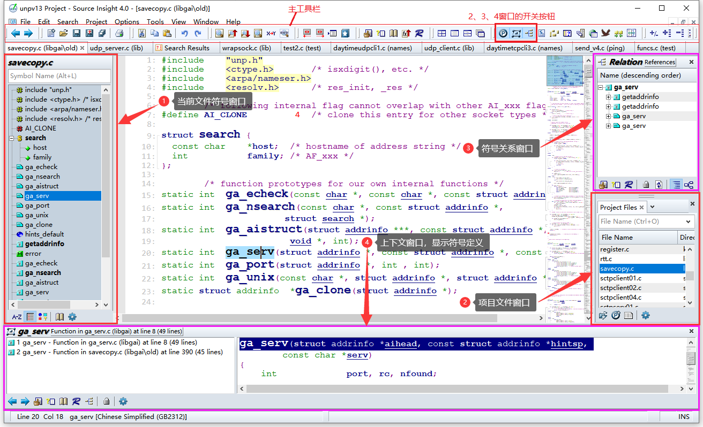

# Source Insight使用笔记

```
Before we dive into the coding, there are a few things I’d like you to know.
First, please watch or star this repo; I would be even happier if you follow me.
Bug reports, questions, and discussions are welcome—you can post an issue or submit a pull request.
```



<!-- MDTOC maxdepth:6 firsth1:1 numbering:0 flatten:0 bullets:1 updateOnSave:1 -->

- [Source Insight使用笔记](#source-insight使用笔记)   
   - [一、环境搭建](#一、环境搭建)   
      - [Source Insight 获取](#source-insight-获取)   
      - [Windows 端 sftp 工具 RaiDrive](#windows-端-sftp-工具-raidrive)   
   - [二、source insight使用](#二、source-insight使用)   
      - [显示空字符](#显示空字符)   
      - [切换主题](#切换主题)   
      - [关闭 Fixed Whitespace 功能](#关闭-fixed-whitespace-功能)   
      - [修改默认编码](#修改默认编码)   
      - [修改字体](#修改字体)   
      - [格式化代码](#格式化代码)   
      - [显示右边界线](#显示右边界线)   
      - [设定TAB宽度](#设定tab宽度)   

<!-- /MDTOC -->

## 一、环境搭建


### Source Insight 获取

参看吾爱破解帖子： <https://www.52pojie.cn/forum.php?mod=viewthread&tid=1797076>

### Windows 端 sftp 工具 RaiDrive

官网： <https://www.raidrive.com/download>


使能挂载点，在`我的电脑`可以访问目录


## 二、source insight使用

### 显示空字符

```text
View -> Visible Tabs and Spaces
```


### 切换主题

```text
Options -> Visual Theme -> Light Blue
```


### 关闭 Fixed Whitespace 功能

避免空格显示异常，建议关闭

```text
Options --> Style Properties，Fixed Whitespace 选择OFF，点击Done
```


### 修改默认编码

```text
Option -> Preference -> Files，修改编码
```


### 修改字体

```text
Option -> File Type Options -> Screen Font
```

推荐 **DejaVu Sans Mono 9**


### 格式化代码

```text
Tools -> Reformat Source Code Options 修改为K&R 类型格式化
```


注意：K&R 比较接近 linux kernel 编码风格，但实际效果一般，最好用内核工具检查一遍。手动修正所有 error!

```shell
./scripts/checkpatch.pl -f security/yama/yama.c
```

### 显示右边界线

```text
Option -> File Type Options -> Show right margin
```


### 设定TAB宽度

```text
Option -> File Type Options -> Tab width
```


注意：内核规范要求制表符（Tab 键）是 8 个字符


---
